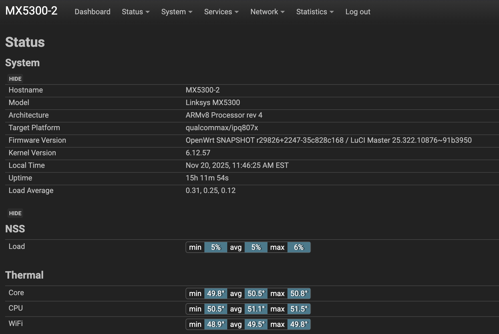
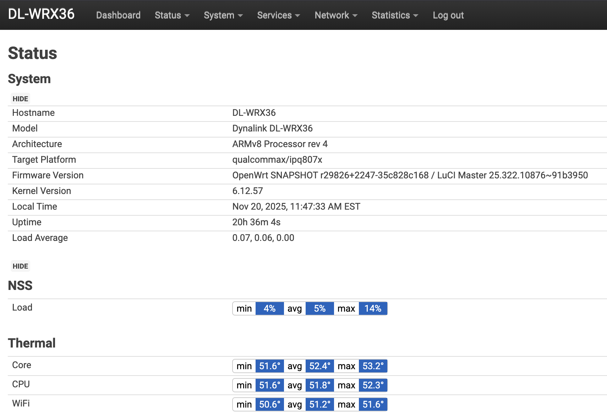

# LuCI Extra

LuCI package for displaying WiFi, CPU, and NSS temperature monitoring on IPQ807x/IPQ60xx routers.

[](LICENSE)

## Overview

This package provides temperature monitoring capabilities for routers using the NSS fork, specifically targeting Qualcomm IPQ807x and IPQ60xx platforms. It displays real-time temperature readings for:

- WiFi radios
- CPU cores
- NSS (Network Subsystem) components

## Installation

### Adding to OpenWrt Feeds

Add this repository to your `feeds.conf` or `feeds.conf.default`:

```conf
src-git luciextra https://github.com/qosmio/luci-extra.git
```

Update and install the feed:

```bash
./scripts/feeds update luciextra
./scripts/feeds install -a -p luciextra
```

Select the package in menuconfig and build your firmware:

```bash
make menuconfig
make -j$(nproc)
```

## Screenshots

### Temperature Display




*Real-time temperature monitoring for WiFi, CPU, and NSS components*

## Compatibility

- **Platforms**: IPQ807x, IPQ60xx
- **Required**: NSS fork of OpenWrt
- **Architecture**: ARM64

## License

Licensed under the Apache License 2.0 - see the [LICENSE](LICENSE) file for details.

---

<div align="center">

If you find this useful, consider supporting the project:

[](https://github.com/sponsors/qosmio)

</div>
